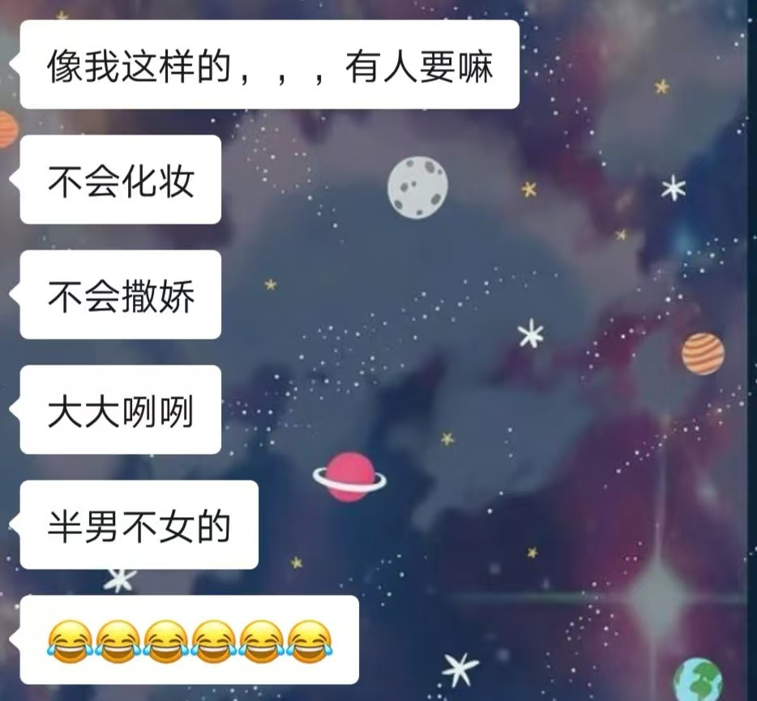

# "使我忘不掉的是她还是我的执念"

> 现在是2026年5月14日早上的8:35，我大约还有半小时就要出发去上班了，但这个mind palace的想法在我心里停了很久了，我真的需要一片空间去把我脑海里的想法写出来。我就先把这一篇完成吧，这也是我目前来说心里最大的结。我就不去查证我所说明内容的具体细节了，按我的记忆来。文中她简称**G同学**

### 翻阅旧的记忆
----

我们是初中同学；在整个初一的时候，我们一直都不太熟说实话，就只能算得上是普通的同学关系而已。我印象里的转变发生在应该是初一下学期还是初二上学期，我有一次的考试成绩突然很不错，进了班里的前几名，这好像才使得我们之间有了多余的话题吧。

我记得那次的政治还是历史来着，当时她和班里另一个女生(课代表)在体育课上给我说了我那科的成绩，我当时脑子一热还倒到操场跑道上了(因为我在小学时候真的不算什么好东西，甚至按我现在的眼光来说可以说是混的人)，我从未想过我也能得到好成绩这种事。现在看来，这也许是除了初一时那个PDC课程之后另一个改变我人生方向的事情。

应该是初二上学期开始吧，我开始减肥了。这里说实话，我最开始减肥的目的是为了去追另一个女是稀里糊涂地让我们在一起了。在这个期间，我因为上学期的好期末成绩，我开始更多地和班里成绩好的同学走的多了，例如kwz、ljj、lzy等(我们是差班，所谓的好学生并不多)；当然这里面也包括G同学，她当时是班里第一。

我初二的整个基调应该就“让自己变好”，减肥成功瘦下来了，同时成绩并没有像以前那样完全一个差学生的模样(我印象里我大部分时间是班里第二三四，她一直班里第一)。正是因为对于学习态度的改变，我也经常去缠着老师问题，学习之类的；当然这种事情她做的最多，我们由此的接触也就变得更多了。我至今记忆犹新的事情就是，在有一次地理课上课前，我们一起去找地理老师；那个老师有一个标志性的“武器”，尺子。老师出发去上课前，让我们帮她把东西拿到教室。作为男生，我肯定更倾向去拿“武器”的。但她也是这样想的，她先抢到了，我就也去从她手里“抢”。抢的过程中，手到底是多少有接触的；我记得她那句：“之前还没男生碰过我的手呢！”

这样暧昧的事情就一点点发生，她生理期我帮她接热水(我不记得有没有抢热水环节了)、她踢我的时候甚至直接把她鞋脱掉这样的……总之就是一直暧昧着，我们应该是初二下正式在一起的。

后面的日子里发生了很多事，那么多我就不细写了，那是回忆录的事情了；有时候我真的为我自己要携带这么多记忆而苦恼，不管是好的坏的，我都记得太清楚了。

简单来说，初二下的时候我们算是“热恋期”；初三的时候被英语老师发现，然后报告了班主任，然后我就进入了被“针对”的日子。我依然记得，中考完回学校的路上，我还拉着她的手和她说：“我们会一直在一起的”。真是唏嘘，因为我的中考炸锅，我只能选择留本校，她考的不错，去了市里的一所top的私立学校，也就还是分开了。

我说我自己保留着很多记忆，不论好的坏的我都记得，但这段记忆，我真的记不起来了：我为什么突然就不理她了，我明明当时在高一时候也没有喜欢上班里其它任何一个女生，这点我是可以保证的。我只能假设，当时我在赌气，应该是当时的我觉得我总是约不出来她，然后就赌气。我只能作这样的猜测了，这份记忆我也不知道他为什么没有保留。总之，我会说活该；特别是我现在处于现在这个“忘不掉她”情形。

应该是在高一下学期她主动和我提了分手，我当时应该是欣然接受了；聊天记录应该在她空间保存着，但不知道还留着吗她。最好笑的是，高三我又主动找人家复合。我在翻阅这些记忆时，真的会给我自己看笑了：“当时干啥去了，现在知道人家好了？”故事继续，我们在高三时又“复合”；这里加引号是因为，我们的复合，至少据她所说，并没有感情基础，而只是为了不影响我的高考；地基不稳的楼是建不高的；我们就这样凑活着，进入大学后，她为了保研，也没什么时间和我聊天。异地恋的buff，加上那时候我因为考的比较差，整体精神状态不太好，做了很多神人操作。总之，2022年那个春节，我又提了分手。

我翻阅了这些记忆，我会笑，年轻的我真的是好不成熟，特别是在感情交流这个方面，我真的差好多。

### 当下
----
分手之后，我并没有放下。忘记她真的是最难的一件事。到现在4年了吧，我一直在想办法去忘掉她，忘掉那些故事。我承认，每一年的某一段时间，我真的放下了向前看，甚至在2023年我还去试着追求别人……当然失败了。四年来，我的发小都在笑话我，开导我；我也各种办法都试过了，我也思考过我为什么怎么都忘不掉，大部分时候，一个梦就会把我之前的所有努力都报废掉。

我印象最深刻的一场梦，梦到我们一起出去玩，一起全国旅游，新疆，西藏，江浙沪，粤港澳……在梦醒的前一刻，我们坐在浑河对岸的椅子上看夕阳；她突然问我：“你有意识到，我们其实已经不在一起了吗？”那一刻，突然我就像坠入深渊一样，周围的一切开始变黑，我感觉到了一阵坠落感。再醒来时，眼泪还没流完……

我目前未知想到的最可能的答案就是：“我一直没接受我已经真正失去她了”(高一的时候干嘛去了？)。至少现在，我是认可这个答案的，因为我花时间思考过自己的行为逻辑，只有这个可能性最大。在分手后还和人家没事聊聊天，只能说自己不接受自己的失败吧，不然我为什么能忘掉我考研初试没上一志愿的结果？因为人家明确地拒接了。

所以我的解决思路是：我找机会见一面她吧。我相信现在的我已经变了很多了，我需要一个最后的答案。不论她会给出我什么样的回复，我都会接受。
如果我们还能续写这个故事，那我会努力去变好；如果没有机会了，那就往前看吧，再精彩的故事也会有结束的一天。

GLHF.

    
    
每次想到她，脑中首先就会浮现这几句话

